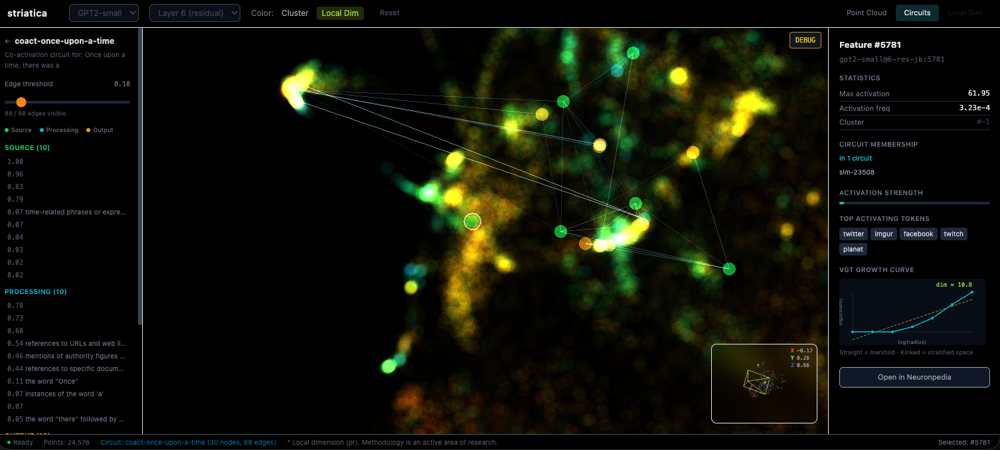

# striatica

[](https://doi.org/10.5281/zenodo.18848240)
> **Paper:** _Striatica: A Geometric Atlas for Machine Intelligence_ —
> [Zenodo](https://doi.org/10.5281/zenodo.18848240)

A geometric atlas for machine intelligence.


# Screenshots
 _Default view._


_Example view of a feature, a circuit, and the local dimension heatmap display._

---

# Quick Start

### Docker (recommended)

No Python, no Poetry, no dependency headaches. Just Docker.

```bash
git clone https://github.com/catwhisperingninja/striatica.git
cd striatica

# Build the container
docker build -t striatica-pipeline .

# Run the GPT-2 Small demo
docker run -t --name striatica -v $(pwd)/output:/app/output striatica-pipeline \
  model --np-id gpt2-small/6-res-jb
```

The container image is built for `amd64` and `arm64` (Intel/AMD and Apple
Silicon both work). If you're on something exotic, build from the Dockerfile and
it should just work.

### Poetry (for development or if you want the interactive frontend)

You need Python 3.12+, [Poetry 2.x](https://python-poetry.org/), and Node.js
18+.

```bash
git clone https://github.com/catwhisperingninja/striatica.git
cd striatica

# Install with ML dependencies (~2GB first run: PyTorch, SAELens, TransformerLens)
poetry install --extras ml

# Run the GPT-2 Small demo — generates data, circuits, launches the frontend
poetry run striat demo
```

`striat demo` walks you through everything: builds the dataset if it doesn't
exist, optionally generates circuits, finds an open port, and starts the
frontend. Open the localhost URL, and you're exploring.

# Responsible Use: Interpretability Safety

**This tool may likely identify features involved in AI safety behaviors.**

Striatica's pipeline generates semantic interpretations of individual features 
and circuits — including features that participate in alignment, honesty, refusal, 
and other safety-relevant behaviors. If these interpretations are published, 
enter model training data, or reviewable by models themselves, theoretically they could be used to identify and circumvent safety 
mechanisms in current and future AI systems.

**What the pipeline does by default:**

For small, well-studied models (GPT-2 Small, Pythia-70M), semantic labels are
included in the output. These models' safety circuits are either non-existent or
already public knowledge.

For all other models, semantic labels are **redacted by default**. The pipeline
produces geometry, topology, clustering, and circuit structure (all
scientifically useful) without the interpretation layer that maps features to
human-readable meanings. This can be overridden with `--include-semantics`, but
please read the following before doing so.

**If you plan to publish research using striatica:**

- Do not publish complete semantic mappings of safety-relevant features for
  capable models.
- If your findings involve features related to alignment, honesty, refusal,
  ethics, or similar safety/alignment behaviors, consult with an AI safety research group
  before publication (e.g., Anthropic, MIRI, ARC, Redwood Research, or your
  institution's AI safety team).
- Consider whether your publication could enable targeted ablation of safety
  circuits.
- Audit outputs and screenshots for exposed semantic data prior to sharing.
- Geometry, topology, and circuit structure without semantic labels appear
  generally safe to publish.

At this time, my understanding is that it is wise to consider this dual-use research in the same category as biosecurity and nuclear
physics. I have been reaching out to experts and various groups since I made this repo public, seeking validation of the findings and assessment of the risk, with very little success. I'm studied enough to suspect there is a strong likelihood that some amount of data will require strict security controls. I'd rather be safe than sorry.

Not everything has been scientifically validated, so there is always the chance that I could be overstating things. Naturally, I am open to feedback as things progress. Please open an issue or tag me in the discussion threads.

---

# Security Notice

striatica is a localhost research tool. It runs a Vite dev server intended for
local exploration only. No authentication, rate limiting, or input sanitization
has been implemented. Please do not expose it to the public internet as-is.

---

# Tech Stack

| Layer        | Tech                                                                    |
| ------------ | ----------------------------------------------------------------------- |
| 3D rendering | React Three Fiber + Three.js + custom GLSL shaders                      |
| UI           | React 19 + TypeScript + Tailwind CSS 4                                  |
| State        | Zustand 5                                                               |
| Pipeline     | Python 3.12 + SAELens + TransformerLens + scikit-learn + UMAP + HDBSCAN |
| Build        | Vite 7 (frontend), Poetry 2.x (striatica)                               |

# Operation

### What `striat demo` does

1. Downloads GPT-2 Small feature metadata from Neuronpedia S3 (public, no API
   key needed)
2. Loads SAE decoder weight vectors from HuggingFace via SAELens
3. PCA (768d → 50d) → UMAP (50d → 3d)
4. HDBSCAN clustering
5. Local dimension estimation (Participation Ratio + VGT growth curves)
6. Assembles JSON for the frontend (~19MB for 24,576 features)
7. Asks if you want to generate the 10 default circuits (5 co-activation + 5
   similarity)
8. Starts the Vite dev server on the first available port from 5173

Compute time is 5–10 minutes on a recent MacBook Pro or equivalent. The data
pipeline runs on CPU; no GPU required for GPT-2 Small.

### Data not included

The generated dataset is too large to commit (~19MB JSON + circuit files). Every
clone generates its own data via `striat demo`. Cached intermediates in
`striatica/data/` speed up subsequent runs.

---

# Process Any Model

striatica works with any SAE dictionary available through
[SAELens](https://github.com/jbloom/SAELens). The demo uses GPT-2 Small Layer 6,
but you can process anything SAELens supports — and the CLI auto-discovers what's
available.

All commands below work identically with Docker or Poetry. Docker examples shown
first; Poetry equivalents follow.

### Discover available models

The `discover` command pulls the live SAELens pretrained registry and shows every
model with Neuronpedia feature data available for processing:

```bash
# Docker
docker run -t --name striatica-discover --rm striatica-pipeline \
  discover --sae-types res
docker run -t --name striatica-discover --rm striatica-pipeline \
  discover --families gpt2,gemma2,llama

# Poetry
poetry run striat discover --sae-types res
poetry run striat discover --families gpt2,gemma2,llama
```

This queries SAELens programmatically — no hardcoded model lists. When SAELens
adds new models, `discover` picks them up automatically.

### Process a model

The recommended way to process a model is by Neuronpedia ID. The CLI
auto-resolves the SAELens release name, hook point, and S3 batch count:

```bash
# Docker
docker run -t --name striatica -v $(pwd)/output:/app/output striatica-pipeline \
  model --np-id gpt2-small/6-res-jb

docker run -t --name striatica-gemma --gpus all \
  -v $(pwd)/output:/app/output striatica-pipeline-gpu \
  model --np-id gemma-2-2b/12-gemmascope-res-16k --device cuda

# Poetry
poetry run striat model --np-id gpt2-small/6-res-jb
poetry run striat model --np-id gemma-2-2b/12-gemmascope-res-16k --device cuda
poetry run striat model --np-id llama3.1-8b/15-llamascope-res-32k --device cuda
```

The `--np-id` flag checks the SAELens registry before downloading anything. If
the model doesn't exist, it fails fast with an error and suggests running
`discover`.

You can also pass explicit SAELens parameters if you need full control:

```bash
poetry run striat model \
  --model gpt2-small \
  --layer 6-res-jb \
  --sae-release gpt2-small-res-jb \
  --sae-hook blocks.6.hook_resid_pre \
  --device auto
```

### Batch processing

Process multiple models sequentially with resume capability:

```bash
# Docker
docker run -t --name striatica-batch -v $(pwd)/output:/app/output striatica-pipeline \
  batch --np-ids "gpt2-small/6-res-jb,gpt2-small/8-res-jb,gpt2-small/10-res-jb" \
  --continue-on-error

# Poetry
poetry run striat batch \
  --np-ids "gpt2-small/6-res-jb,gpt2-small/8-res-jb,gpt2-small/10-res-jb" \
  --continue-on-error

# Force reprocess even if output exists
docker run -t --name striatica-batch -v $(pwd)/output:/app/output striatica-pipeline \
  batch --np-ids "..." --force
```

### Hardware guidance

| Model              | Features | RAM   | Time (approx) | GPU                  |
| ------------------ | -------- | ----- | ------------- | -------------------- |
| GPT-2 Small (demo) | 24,576   | 16GB  | 5–10 min      | not needed           |
| Gemma 2B (16K)     | 16,384   | 16GB  | 10–20 min     | recommended          |
| Gemma 2B (65K)     | 65,536   | 32GB  | 30–60 min     | recommended          |
| Llama 3.1 8B (32K) | 32,768   | 32GB  | 30–60 min     | strongly recommended |
| Llama 3.1 8B (131K)| 131,072  | 64GB+ | 1–2 hr        | strongly recommended |
| Gemma 2 9B+        | 131,072+ | 64GB+ | 2–6 hr        | required             |

VGT growth curve computation is the bottleneck — it's O(n²) on the feature
count. Large dictionaries benefit significantly from GPU acceleration.

### After generating

Once your model's data is in `frontend/public/data/`, launch the frontend and
pass the dataset filename as a query parameter:

```bash
cd frontend && pnpm install && pnpm dev
# Then open: http://localhost:5173/?dataset=gemma-2-2b-12-gemmascope-res-16k.json
```

The `striat model` command prints the exact URL to open when it finishes.

### CLI reference

| Flag                   | Description                                          | Default |
| ---------------------- | ---------------------------------------------------- | ------- |
| `--np-id`              | Neuronpedia ID (auto-resolves everything)            | —       |
| `--model`              | Model ID (explicit mode)                             | —       |
| `--layer`              | Layer identifier (explicit mode)                     | —       |
| `--sae-release`        | SAELens release name (explicit mode)                 | —       |
| `--sae-hook`           | SAELens hook point (explicit mode)                   | —       |
| `--num-batches`        | S3 batch count (auto-probed with `--np-id`)          | 24      |
| `--features-per-batch` | Features per S3 batch                                | 1024    |
| `--device`             | Torch device: `auto`, `cuda`, `mps`, `cpu`           | `auto`  |
| `--json-export`        | Export JSON only, skip frontend launch instructions  | off     |
| `--include-semantics`  | Include semantic labels for non-public-tier models   | off     |

---

# Docker Reference

Two Dockerfiles are provided: `Dockerfile` (CPU) and `Dockerfile.gpu` (NVIDIA
GPU). Build whichever you need:

```bash
docker build -t striatica-pipeline .                              # CPU
docker build -f Dockerfile.gpu -t striatica-pipeline-gpu .        # GPU
```

All CLI subcommands (`model`, `discover`, `batch`) work in either container.
Mount a volume to `-v $(pwd)/output:/app/output` to get results out. Use
`--name` to keep `docker ps` clean.

### Semantic labels

Semantic labels (feature explanations) are redacted by default for models
outside the public tier. Add `--include-semantics` to any `model` or `batch`
command to include them. This works the same in Docker and Poetry.

Please read the [Responsible Use](#responsible-use-interpretability-safety) section before publishing
semantic data for capable models.

### Platform and performance notes

The Docker image uses `python:3.12-slim` which supports `amd64` and `arm64`
natively. Intel, AMD, and Apple Silicon all work out of the box. If you're on
something else, building from the Dockerfile should handle it.

**Laptop users:** The pipeline uses all available CPU cores by default (minus
one for the OS). On a laptop this can push thermals hard, especially during VGT
computation. If you're on a MacBook or similar thin-and-light, consider using
Docker Desktop's resource limits (Settings → Resources) to cap CPU cores, or use
a cloud instance for anything beyond GPT-2 Small. The pipeline is designed for
beefy server CPUs — it will happily saturate whatever you give it.

---

# Cloud Preprocessing

Scripts are included for running the pipeline on cloud GPU instances. Use
`--plan` to see instance size recommendations before spending money.

```bash
# See recommendations (dry run, no cost)
./scripts/cloud_preprocess.sh --plan --gpu --np-id gemma-2-9b/20-gemmascope-res-16k
```

### Lambda AI (recommended for GPU)

```bash
# On a Lambda GPU instance:
./scripts/lambda_quickstart.sh --np-id gemma-2-2b/12-gemmascope-res-16k

# Or batch multiple models:
./scripts/lambda_quickstart.sh --np-ids "gpt2-small/6-res-jb,gemma-2-2b/12-gemmascope-res-16k"
```

A single A100 processes GPT-2 Small in ~2 minutes and Gemma 2B in ~20 minutes.

### Azure

```bash
# Provisions a VM, runs the pipeline, downloads results
./scripts/azure_quickstart.sh --gpu --np-id gemma-2-2b/12-gemmascope-res-16k

# IMPORTANT: tear down when done to stop charges
./scripts/azure_quickstart.sh --teardown
```

### Remote compute, local visualization

To run on any remote server and view results locally:

```bash
# On remote server (Docker or Poetry — either works)
docker run -t --name striatica-remote -v $(pwd)/output:/app/output striatica-pipeline \
  model --np-id gemma-2-2b/12-gemmascope-res-16k --device cuda

# Copy output to your local machine
scp remote:~/output/*.json ./frontend/public/data/

# On local machine
cd frontend && pnpm dev
# Open: http://localhost:5173/?dataset=gemma-2-2b-12-gemmascope-res-16k.json
```

---

# Circuits

Generate circuit data to see how features connect during specific computations.

```bash
# All 10 default circuits (5 co-activation + 5 similarity)
poetry run striat circuits --batch-defaults

# Co-activation: which features fire together on a prompt
poetry run striat circuits \
  --type coactivation \
  --prompt "The capital of France is" \
  --name my-capital-circuit

# Similarity: BFS through cosine-similar features from a seed
poetry run striat circuits \
  --type similarity \
  --seed-feature 23123 \
  --name my-sim-circuit
```

Co-activation circuits require the ML extras (runs the model on CPU). Similarity
circuits only need the base install — they use cosine similarity data already
present in the Neuronpedia download.

| Flag               | Description                                           | Default                            |
| ------------------ | ----------------------------------------------------- | ---------------------------------- |
| `--batch-defaults` | Generate all 10 default circuits                      | —                                  |
| `--type`           | `coactivation` or `similarity`                        | required unless `--batch-defaults` |
| `--prompt`         | Input text (co-activation only)                       | required for coactivation          |
| `--seed-feature`   | Feature index for BFS root (similarity only)          | required for similarity            |
| `--name`           | Circuit ID, used as filename                          | auto-generated                     |
| `--top-k`          | Features to include (coact) / neighbors per hop (sim) | 30                                 |
| `--min-weight`     | Minimum edge weight to keep                           | 0.1                                |
| `--depth`          | BFS depth for similarity                              | 2                                  |

Output: `frontend/public/data/circuits/<name>.json` + updated `manifest.json`

---

# Views

**Point Cloud** — All features positioned by decoder weight similarity (UMAP
projection to 3D). Color by cluster membership or local intrinsic dimension.
Click any point to inspect its metadata, activation stats, top tokens, VGT
growth curve, and Neuronpedia link.

**Circuits** — Select a circuit from the panel to visualize which features
participate. Nodes colored by role: source (green), processing (cyan), output
(amber). Edge threshold slider controls visibility by connection strength. ⌘P /
Ctrl+P toggles between views.

**Cross-view sync** — Selection, camera position, and cluster highlighting all
persist across view switches. Circuit members are highlighted in the point cloud
(boosted size and brightness). Selecting a circuit member and switching to
Circuits view auto-loads the relevant circuit.

---

# Controls

| Input                | Action                                                      |
| -------------------- | ----------------------------------------------------------- |
| Click                | Select a feature point                                      |
| Search box           | Find features by index or description, click to fly to them |
| Double-click cluster | Fly camera to cluster centroid                              |
| Drag                 | Orbit                                                       |
| Scroll               | Zoom (speed adapts to distance)                             |
| Right-drag           | Pan                                                         |
| Shift-click cluster  | Multi-select clusters (up to 10)                            |
| ⌘P / Ctrl+P          | Toggle Point Cloud ↔ Circuits view                          |
| Backtick (`` ` ``)   | Toggle debug console (live state, transitions)              |

---

# Installation Details

### Pipeline (Python)

```bash
poetry install --extras ml    # full install with PyTorch, SAELens, TransformerLens (~2GB)
poetry install                # lightweight: numpy/scipy/sklearn/umap/hdbscan only
```

The lightweight install is enough for similarity circuits and re-running the
frontend on existing data. Co-activation circuits and `striat model` require the
ML extras.

#### Linux prerequisites

Some Python dependencies (notably hdbscan) compile C extensions from source. On
Ubuntu/Debian, install build tools before running `poetry install`:

```bash
sudo apt update && sudo apt install -y build-essential python3-dev
```

#### GPU and VM notes

The data pipeline device flag controls where PyTorch runs SAE and model
inference. On an NVIDIA GPU, this is `cuda`. On Apple Silicon, `mps`. If you are
in a VM without GPU passthrough or on a system without a supported GPU, the
pipeline falls back to `cpu` — everything still works, just slower for larger
models.

| System                             | Device |
| ---------------------------------- | ------ |
| NVIDIA GPU (native or passthrough) | `cuda` |
| Apple Silicon (M1/M2/M3/M4)        | `mps`  |
| VM without GPU / CPU-only          | `cpu`  |

GPT-2 Small runs comfortably on CPU. Gemma 2B and larger models benefit
significantly from GPU acceleration.

### Frontend (Node.js)

```bash
cd frontend
pnpm install        # or: npm install -g pnpm && pnpm install
pnpm dev            # dev server, default port 5173
pnpm build          # production build
pnpm preview        # serve production build
```

If you don't have pnpm, `corepack enable` will make it available (requires
Node.js 18+).

### Tests

```bash
poetry run pytest tests/ -v                  # all fast tests
poetry run pytest tests/ -v -m "not slow"    # skip model-download tests
```

---

# Project Structure

```
pipeline/          # Python package — config, download, vectors, reduce, cluster,
                   #   circuits, local_dim, prepare, cli
scripts/           # Entry point scripts (process_gpt2_small, generate_circuits)
tests/             # pytest suite
data/              # Cached downloads (JSONL from Neuronpedia S3, gitignored)

frontend/
  src/
    components/    # UI panels (TopBar, NavPanel, CircuitPanel, DetailPanel, DebugConsole)
    three/         # R3F components (PointCloudMesh, FlyToCamera, CircuitNodes, etc.)
    views/         # View compositions (PointCloudView, CircuitGraphView)
    stores/        # Zustand store (useAppStore)
    shaders/       # Custom GLSL vertex/fragment shaders
    config/        # Centralized rendering parameters
    types/         # TypeScript interfaces
    utils/         # Data loaders, color scales, camera sync
  public/data/     # Generated JSON (gitignored — run striat demo to populate)
```

---

# Roadmap

Planned features, roughly in priority order:

- **Multi-dataset switching** — load multiple model JSONs and switch between
  them in the UI
- **Local Dimension view** — third view mode visualizing per-feature intrinsic
  dimensionality
- **3D export** — export clusters or circuits as glTF/OBJ for use in Blender, 3D
  viewers, or presentations
- **Annotation system** — save and share named camera positions + selection
  states
- **Public deployment mode** — auth, rate limiting, and input sanitization for
  hosted instances

---

# Contributing

striatica is a solo research project and very much a work in progress. If you
run into bugs, have questions, or want to suggest improvements, please open an
issue or start a thread in
[Discussions](https://github.com/catwhisperingninja/striatica/discussions). Pull
requests are welcome.

If something doesn't work on your system, please include your OS, Python
version, Node version, and any error output — it helps enormously.
