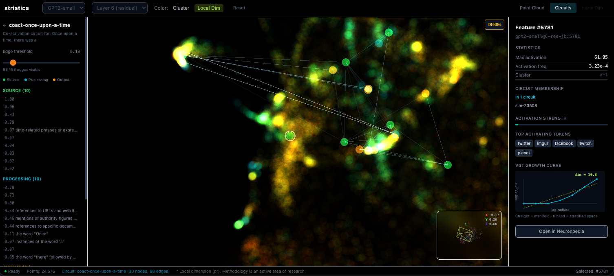

# striatica

[](https://doi.org/10.5281/zenodo.18848240)

A geometric atlas for machine intelligence — 3D visualization of neural network
interpretability features from sparse autoencoder and transcoder decoder weight
geometry. **Paper:** _Striatica: A Geometric Atlas for Machine Intelligence_ —
[Zenodo](https://doi.org/10.5281/zenodo.18848240).



_A feature, a circuit, and the local-dimension heatmap._

> ### ⚠ Errata — read before citing circuit claims
> The co-activation circuit extraction was a correlational Jaccard heuristic, not
> causal attribution. Those circuit claims are **retracted** and circuits are being
> rebuilt on Neuronpedia attribution graphs. Geometric findings are unaffected.
> See **[ERRATA.md](ERRATA.md)** for the full scope.

---

## How the CLI is invoked

striatica ships one pipeline CLI, reachable three equivalent ways. All run
`pipeline.cli` with identical subcommands and flags:

- **Host install:** `striat <cmd>` — the `striat` console script from `pip install -e .`
- **Docker:** `docker run <image> <cmd>` — the image is tagged `striatica` (CPU) or
  `striatica-gpu` (GPU); its entrypoint is `python -m pipeline.cli`
- **Module form:** `python -m pipeline <cmd>`

## Quickstart (Docker, CPU)

GPT-2 Small needs no GPU. This builds the image, generates the demo dataset directly
into the frontend's data directory, and serves the viewer.

```bash
# 1. Build the CPU image
docker build -t striatica .

# 2. Generate the GPT-2 Small demo dataset into the frontend data dir.
#    First run downloads ~2 GB of SAE activations from Neuronpedia S3.
docker run -t --rm -v "$(pwd)/frontend/public/data:/app/frontend/public/data" \
  striatica model --np-id gpt2-small/6-res-jb

# 3. Launch the viewer (needs Node + pnpm on the host)
cd frontend && pnpm install && pnpm dev

# 4. Open the atlas
open http://localhost:5173/?dataset=gpt2-small-6-res-jb.json
```

The container writes to `/app/frontend/public/data`, so the mount above lands the JSON
where the frontend serves it — no copy step.

## Docker

```bash
docker build -t striatica .                        # CPU
docker build -f Dockerfile.gpu -t striatica-gpu .  # NVIDIA GPU
```

All subcommands (`demo`, `model`, `discover`, `batch`, `validate`, `circuits`) run in
either image. For larger models on the GPU image, add `--gpus all` and `--device cuda`:

```bash
docker run -t --rm --gpus all -v "$(pwd)/frontend/public/data:/app/frontend/public/data" \
  striatica-gpu model --transcoder gemma-2-2b/12/604 --device cuda
```

**UMAP reproducibility.** UMAP output is not reproducible across library versions, even
with the same `random_state=42` — a single patch bump to numpy, scipy, scikit-learn,
umap-learn, or a transitive dep silently produces different 3D positions. Both Dockerfiles
pin the exact reproducibility chain and install it with pip (no lockfile resolution), so
Docker is the only guaranteed-reproducible path. Do not regenerate the lockfile — see
[CONTRIBUTING.md](CONTRIBUTING.md).

## CLI

Run `striat --help` (or `docker run striatica --help`) for the full reference. Common
subcommands:

```bash
# Process an SAE by Neuronpedia ID (auto-resolves release, hook, and S3 batch count)
striat model --np-id gpt2-small/6-res-jb

# Process a Gemmascope transcoder (model/layer/l0 spec)
striat model --transcoder gemma-2-2b/12/604 --device cuda

# Discover available models from the SAELens registry (no hardcoded lists)
striat discover --families gpt2,gemma2 --sae-types res

# Process several models sequentially
striat batch --np-ids "gpt2-small/6-res-jb,gpt2-small/8-res-jb" --continue-on-error

# Validate an output JSON (optionally compare to a reference)
striat validate frontend/public/data/gpt2-small-6-res-jb.json

# One-command host demo: data + circuits + frontend (Poetry install, not Docker)
striat demo
```

`--device` defaults to `auto` (cuda → mps → cpu); `--pca-dim` defaults to `auto`
(`min(d//4, 300)`). Semantic labels are redacted by default for non-public-tier models
(see below).

## Method

Each feature is the decoder weight vector for one SAE or transcoder direction. The
pipeline reduces those vectors with PCA (adaptive `min(d//4, 300)`), projects to 3D with
UMAP, clusters with HDBSCAN, and estimates each feature's local intrinsic dimension via
participation ratio and VGT growth curves. This UMAP geometry is being superseded by a
stratified-geometry pipeline (topological, non-UMAP); see the [paper](https://doi.org/10.5281/zenodo.18848240).

## Semantic labels and dual-use research

Semantic labels map human-readable meanings onto individual computational features,
including alignment, honesty, refusal, and safety features. Treat them as dual-use material.

**The pipeline redacts semantic labels by default.** They are included only for
public-tier models — those whose interpretability data is already openly published:
**GPT-2 Small, Pythia-70M, and Gemma-2-2B** (Gemma Scope is Google DeepMind's open
interpretability release; Neuronpedia hosts its full explanations publicly). Every
other model outputs geometry only — positions, clusters, local dimensions, and
activation stats. The `--include-semantics` flag overrides this for authorized research.

- Never commit labels to version control, bake them into Docker images, or log them.
- Audit all outputs and screenshots for exposed semantic data before sharing.
- If your work touches alignment, honesty, refusal, or safety features, consult an AI
  safety group (Anthropic, MIRI, ARC, Redwood, or your institution's) before publishing.

## Validation

A three-level suite runs automatically on every pipeline execution and writes a
validation sidecar JSON alongside each output.

- **Level 1 (structural integrity)** — hard gate: array alignment, position bounds,
  cluster labels, index continuity, centroid accuracy. Any failure aborts the run.
- **Level 2 (embedding quality)** — scorecard: trustworthiness, neighborhood overlap,
  silhouette, PCA explained variance, axis spread. Trustworthiness > 0.85 means the 3D
  embedding preserves local high-dimensional structure.
- **Level 3 (cross-model comparison)** — optional (`striat validate out.json --compare
  reference.json`); compares distributional signatures between two datasets.

## Visualization

**Point Cloud** — features positioned by decoder-weight similarity, colored by cluster or
local dimension; click a point for metadata, activation stats, VGT growth curve, and
Neuronpedia link. **Circuits** — features in a circuit, colored by role (being rebuilt on
Neuronpedia Circuit Tracer). Selection, camera, and cluster highlighting persist across
view switches.

| Input                | Action                             |
| -------------------- | ---------------------------------- |
| Click                | Select a feature point             |
| Search box           | Find features by index/description |
| Double-click cluster | Fly to cluster centroid            |
| Drag / Scroll / Right-drag | Orbit / Zoom / Pan           |
| Shift-click cluster  | Multi-select clusters (up to 10)   |
| Cmd+P / Ctrl+P       | Toggle Point Cloud / Circuits      |
| Backtick             | Toggle debug console               |

Open any generated dataset at `http://localhost:5173/?dataset=<output>.json`.

## Roadmap

- **Circuit Tracer integration** (in progress) — causal circuit data via Neuronpedia
  Circuit Tracer, replacing the retracted Jaccard co-activation heuristic.
- **v4 stratified-geometry pipeline** — topological reduction replacing UMAP.
- **Transcoder semantic explanations**, **multi-model comparison**, **Local Dimension
  view**, **pipeline observability**, **glTF/OBJ export**, and a hardened public
  deployment mode.

## Contributing & security

Development setup, tests, and contribution rules are in
**[CONTRIBUTING.md](CONTRIBUTING.md)**. Licensed under the MIT [LICENSE](LICENSE).

striatica is a localhost research tool: the Vite dev server has no authentication, rate
limiting, or input sanitization — keep it on localhost, off the public internet.
